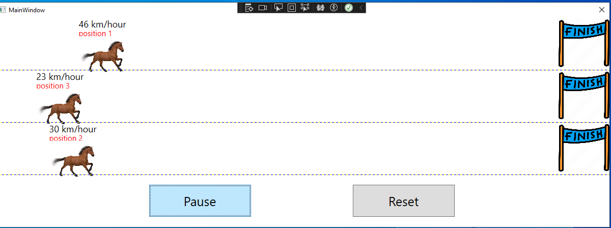
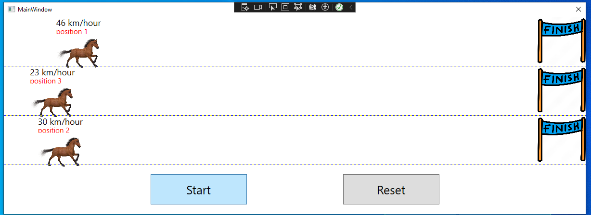
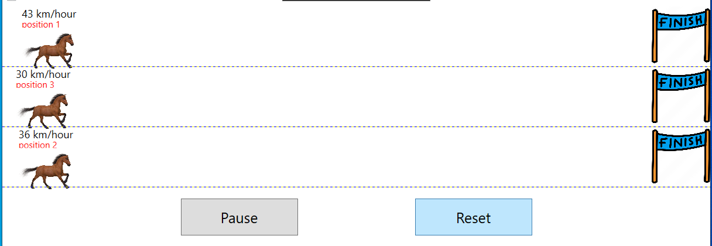
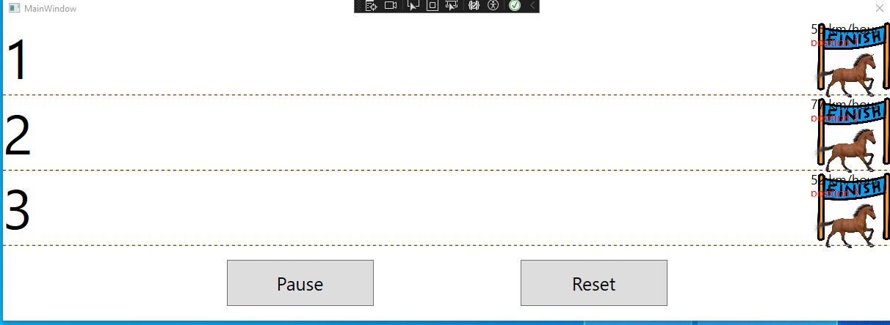

**ЛАБОРАТОРНАЯ РАБОТА №4** 

**Создание пользовательских элементов управления** 

1. **Цель работы** 

Освоить методику создания пользовательских элементов управления. Изучить способы использования делегатов и событий.  

2. **Постановка задачи**  
1) Создать проект типа WPF ControlLibrary.  
2) Запрограммировать пользовательский элемент управления.  
3) Добавить в элемент нужные свойства и события.  
4) Написать  приложение  типа  WPF,  использующее  созданный  элемент. Приложение должно иметь кнопки Старт/Пауза (для запуска и приостановки игры) и Сброс (для возврата игры в начальное состояние), а также поля для вывода информации об объектах игры согласно заданию.  
3. **Индивидуальные задания**
7) Разработать пользовательский элемент управления, реализующий игру “Бег лошадей по прямой”. Скорость движения лошадей должна  задаваться случайным образом.  При  щелчке  правой  клавиши  мыши  по  изображению  лошади  должна выводиться  информация  о  ее  скорости,  при  щелчке  левой  клавишей  мыши информация о ее позиции.  

**4.  Рекомендации к выполнению задания.** 

Для каждого объекта игры создайте класс, описывающий основные свойства объекта (например, координаты, скорость и др.). Для движущихся объектов опишите метод,  выполняющий  одну  итерацию  перемещения  объекта  с  последующим изменением текущих координат (например, метод Move()). 

Если движущихся объектов много, то сохраните объекты в обобщенном списке, например  в  List<T>.  В  дальнейшем  для  выполнения  одного  перемещения  всех объектов достаточно будет обойти коллекцию и вызвать метод Move() у каждого объекта. 

Если  у  разных  объектов  разные  алгоритмы  перемещения  (как  в  задании «Бомбометание» - самолет и бомба), то сначала опишите абстрактный класс, явно описывающий  общие  свойства  и  методы.  Метод  перемещения  объектов  нужно сделать  абстрактным.  Производные  классы  должны  будут  реализовать  этот абстрактный алгоритм. В качестве типа обобщенного списка объектов нужно будет указать базовый абстрактный класс. 

Для того, чтобы графические элементы игры изменяли свое положение при изменении  свойств  координат  соответствующих  объектов  выполните  привязку положения  элементов  (например,  свойств  Canvas.Top  и  Canvas.Left)  к соответствующим свойствам (X и Y) 

**Результат лабораторной работы:**

При нажатии кнопку старт, она будет переименовываться в кнопку "Pause" и обьекты лошадей начнут двигаться:

При нажатии на кнопку паузы, обьекты лошадей остановятся и название кнопки поменяется на "Start":

При нажатии на кнопку ресет, обьекты лошадей начнут забег заново:

При достижении обьектов финиша появятся их занятые места (слева) при забеге :
